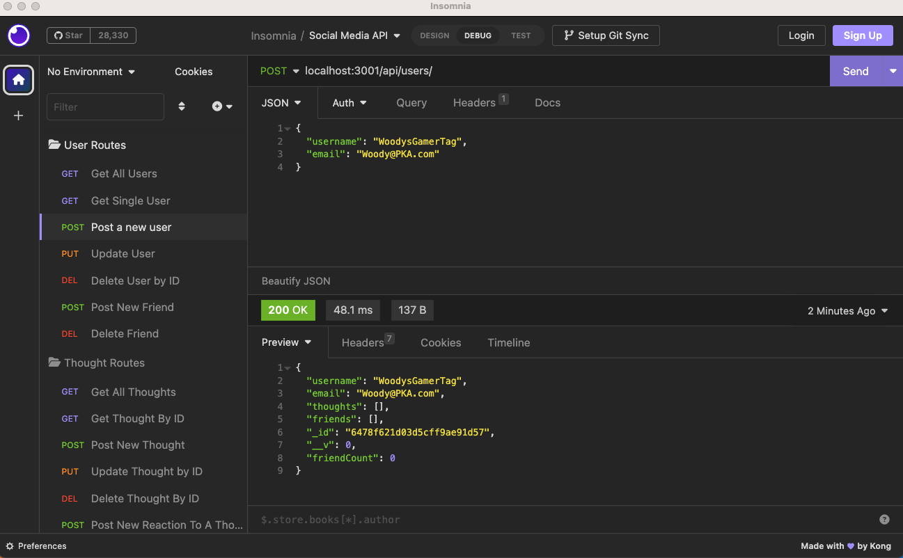

# <Social-Media-API>

## Description

This is the backend for setting up a basic social media site. It offers CRUD operations for Users and their thoughts and allows you to add reactions and friends. It's set up more like Twitter than anything else in that you more so follow people when they become your friend instead of having a connection with them. 

- I was motivated to do this by my dislike of social media.
- Because I dislike social media I chose to create the backend of one to better understand it. Keep you enemies closer as they say. 
- If there comes a day when I want to start a social media site then I'll have this already built
- From building this I learned that there are very different tiers of quality for technical documentation. Mongoose is far inferior to Sequelize. I also learned a lot about MongoDB and Mongoose.


## Installation

To install this just clone the repository and run "npm i"

## Usage

To start the server just run "npm run start" in the root directory.

For reference, this is what your first Post request should look like. You'll need to use this format to get started by posting your first userl

    ```md

    ```

## Credits

Developer- Everitt Gill

Github- https://github.com/EverittGill

Tutorials followed- GA Tech fullstack development bootcamp resources and classes


## License

MIT License

## Features

All CRUD operations for Users and their thoughts, adding and removing reactions and friends. It also keeps track of the number of reactions and friends for users and thoughts.

## How to Contribute

Message me on Github

